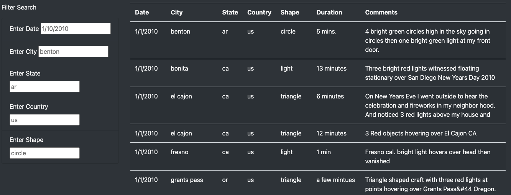
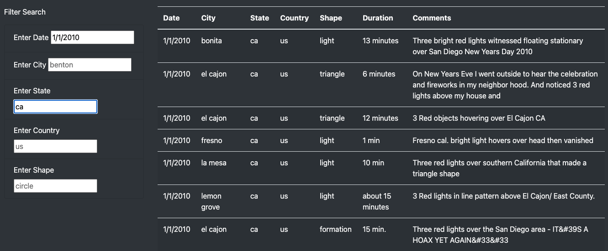
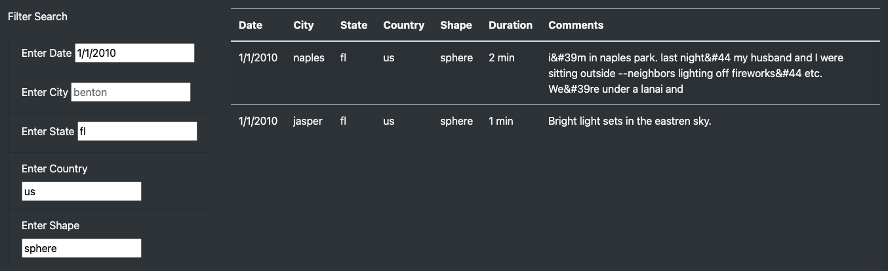
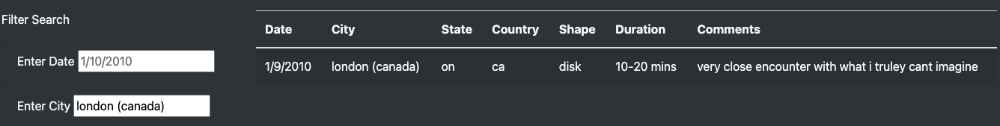
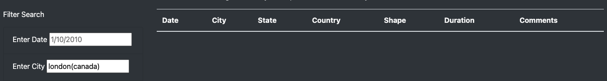

# UFOs

## Overview

For this project we are building an HTML page and a table using data stored in a JavaScript array. Additionally, we are creating multiple search parameters and filter functions using JavaScript to construct an updated and dynamic webpage that will react to user inputs and allow users to interact with visualizations. The webpage would be customized using Bootstrap.

## Resources

- Data

  - data.js 
  - nasa.jpg

## Results

### 1) UFO Finder Homepage
The HTML Page was customized by adding specific Bootstrap styling and CSS components such as background color and an image to Jumbotron header.

### 2) Filter Search and Table
The bottom half of the HTML page has a "Filter Search" and a "Table" section. There are five filter criteria for users to input and select, that are date, city, state, country, and shape. Users could follow the example text provided in the input box to search for a desired result. While there are five search criteria, users may filter any number of the criteria they prefer. If none of the filteres are entered, the page will show and list all the data that are stored.

### 3) Example 1:
Filter two criteria: ***Date 1/1/2010*** and ***State CA***
- Enter Date: input "1/1/2010"
- Enter State : input "ca"

### 4) Example 2: 
Filter four criteria: ***Date 1/1/2010***; ***State FL***; ***Country US***; and ***Shape sphere***
- Enter Date: input "1/1/2010"
- Enter State: input "fl"
- Enter Country: input "us"
- Enter Shape: input "sphere"

## Summary

### Drawback
One drawback of this webpage is that users have to "guess" the optimal search keyword to input because they are not provided on what data is available. 
For example, currently the date search criteria let users input any date they prefer without suggesting a recommended range. If refer back to the original JavaScript array (data.js), all recoreded elements are between dates 1/1/2010 and 1/13/2010. In other words, any date search outside this range will return an empty table with no results, which could be very disappointing to our users. 

### Recommendations

1) Currently the filter works **ONLY** when an input is 100% matching the data. More coding could be done to allow partial intakes.
For example, users right now have to input **"london (canada)"** if they are trying to search for London city in Canada. The search will not return any result if any of the search characters are missing, including the space between the two words.

2) Similarly, some coding could be done on the date filter so that it could filter the data by a broader date range such as by month (e.g 05/2010) or by year (2011) instead of by a specific date (e.g. 01/01/2010). This may help the drawback mentioned earlier. Users then are able to find out quicker if any data even exists for the year they are interested in.
